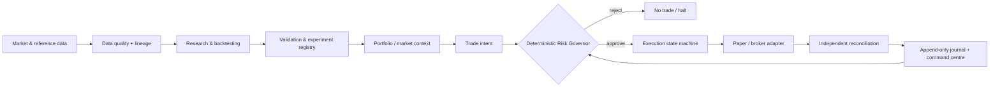

# Optimus Prime

[](https://github.com/udited22/optimus-prime/actions/workflows/ci.yml)

**A research-first quantitative trading system built around reproducibility, deterministic risk and capital discipline.**

Optimus Prime treats systematic trading as an end-to-end systems problem: data quality, hypothesis testing, validation, portfolio construction, risk control, execution and observability all have to work together before a strategy is eligible for capital.

> **Current status — research and paper only.** No strategy has cleared the full validation standard and this public build cannot place live orders. Every P&L, trade and dashboard figure shown here is simulated or produced by a backtest.


## Why this exists

Most trading projects start with a signal and bolt controls on later. Optimus Prime starts with the opposite assumption: **an apparent edge is worthless unless the system can prove it survives realistic costs, out-of-sample testing, regime changes and deterministic risk constraints.**

The research layer is intentionally allowed to experiment. Transactional authority is not. Research can propose; deterministic software decides whether an intent is admissible, and the execution path can always refuse to trade.

## Architecture



The system is deliberately split into four public concepts:

- **Research** — market data, hypotheses, backtests, cost models, validation and experiment tracking.
- **Portfolio** — market context, regime information and strategy/capital allocation.
- **Risk** — a deterministic governor with absolute veto authority, exposure controls and latched safety stops.
- **Execution** — typed trade intents, order state machines, idempotency, reconciliation and broker adapters.

Language models or research agents are never part of the authoritative order path.

## What is built today

| Layer | Current capability |
|---|---|
| **Data** | Exchange calendars and instrument metadata, resumable historical-data ingestion, public crypto/US starter loaders, content-addressed Parquet storage, lineage and data-quality quarantine. Market data itself is not committed. |
| **Research** | Event-driven backtester, versioned strategy specifications, structure simulator, realistic cost modelling, holdout testing, experiment registry and a multi-stage validation toolkit. |
| **Portfolio** | Market-context/regime plumbing and portfolio allocation primitives. These remain research components until independently validated. |
| **Risk** | Deterministic Risk Governor, typed risk decisions, kill switches, state reconstruction from the journal and fail-closed handling of untrusted state. |
| **Execution** | Order state machine, idempotent request handling, fake/paper adapters and independent reconciliation. Live execution is disabled in the public build. |
| **Observability** | Read-only TypeScript command centre backed by real kernel/Governor events generated against simulated execution. |

## Evidence over optimism

The system has already rejected considerably more research than it has promoted. Roughly **445 registered trials across five years of NIFTY one-minute history currently produce no strategy that clears the full validation standard.** Several attractive in-sample results disappear after costs, holdout testing or uncertainty analysis.

That is a feature, not an embarrassment: Optimus Prime is designed to make false confidence difficult to operationalise.

- [Research methodology](docs/research/methodology.md)
- [Validation framework](docs/research/validation.md)
- [Negative results](docs/research/negative-results.md)
- [Cost-drag study](docs/research/cost-drag-study.md)

## Engineering principles

1. **Evidence before capital.** A strategy must earn promotion through reproducible evidence rather than a visually attractive backtest.
2. **No trade is a valid decision.** If data, state, liquidity or risk is outside policy, the correct output is no new exposure.
3. **Risk is independent of strategy.** Strategy code cannot relax portfolio or execution constraints.
4. **Fail closed.** Unknown or inconsistent state blocks new entries; safety controls are explicit and testable.
5. **Broker state is external truth.** Reconciliation is independent of the component that created the order.
6. **Be explicit about uncertainty.** `SIMULATED`, `ASSUMED` and `UNVERIFIED` are labels, not footnotes.

## Explore the system

- [Architecture](docs/architecture/architecture.md) — system boundaries and trust model.
- [Risk engine](docs/risk/risk-engine.md) — deterministic admission and safety controls.
- [Research methodology](docs/research/methodology.md) — how experiments are structured.
- [Validation](docs/research/validation.md) — promotion gates and holdout discipline.
- [Private-alpha boundary](docs/engineering/private-alpha.md) — how reusable infrastructure remains public without publishing live research candidates.

## Install and test

Python 3.12+ is required; Node 20+ is used by the command centre.

```bash
python -m venv .venv
.venv/bin/pip install -e ".[dev]"
(cd dashboard && npm ci)

.venv/bin/ruff check src tests scripts
.venv/bin/ruff format --check src tests scripts
.venv/bin/mypy
.venv/bin/python -m pytest -q
(cd dashboard && npm test -- --run && npm run build)
```

CI runs the same quality gates on every push and pull request.

## Repository map

```text
src/        trading-system engine: data, research, portfolio, risk, execution and observability
tests/      unit, property, failure-injection and integration tests
configs/    versioned public configuration and reproducibility inputs
specs/      public research specifications; no live candidate alpha
examples/   synthetic examples and paper-mode fixtures
dashboard/  read-only command centre
docs/       curated architecture, methodology, risk and research documentation
```

## Public engine, private alpha

This repository intentionally publishes the reusable engine rather than live candidate strategies. Exact rules, parameters and current research candidates belong in a separate gitignored/private alpha library. Public synthetic stand-ins exercise the same schemas and safety boundaries without exposing candidate IP.

See [docs/engineering/private-alpha.md](docs/engineering/private-alpha.md).

## Scope and disclaimer

Optimus Prime is a personal engineering and quantitative-research project. It is not an investment product, signal service or recommendation. Backtests and simulations are not evidence of future returns, and market trading can result in substantial losses.

The public repository is intentionally free of credentials, personal capital targets, broker-account details, live strategy parameters and trading journals.
