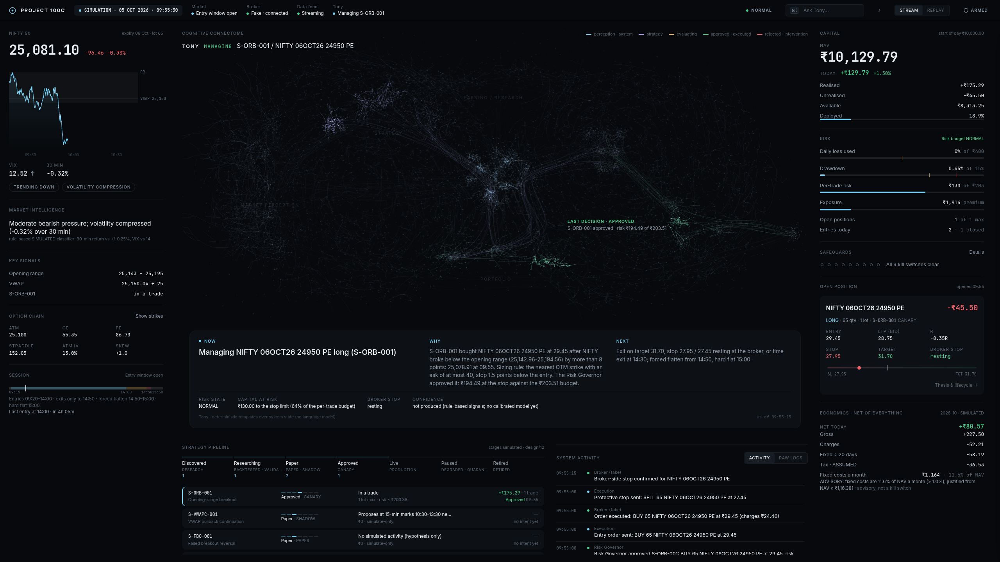

# Optimus Prime

**Optimus Prime is an experimental multi-market quantitative trading and capital-allocation system designed to discover, validate and deploy systematic trading strategies under deterministic risk controls.** Project 100C began as its first vertical slice, focused on Indian index derivatives; the broader architecture is evolving toward market-wide opportunity discovery, multi-strategy portfolio allocation and additional asset classes.

> **Status: no validated edge yet. No live trading.** No order has ever been sent to a real broker. Every P&L, trade and dashboard figure in this repository is SIMULATED or a backtest. This is a personal research project, not investment advice and not an offer of any service.



## Principles

- **Research can be clever; trading must be boring.** The research plane may explore anything but has no authority to place orders. The production plane is deterministic: no language model, no discretionary override.
- **Evidence before capital.** A strategy earns capital only with positive expectancy after realistic costs, out-of-sample robustness, a known minimum viable capital and an acceptable risk of ruin.
- **"No trade" is a valid position.** If the smallest executable position exceeds the risk budget, the system does not trade.
- **Fail loud, prefer stopping.** Unknown or untrustworthy state disables entries; kill switches latch and survive restarts.
- **Honest labels.** SIMULATED, ASSUMED and UNVERIFIED are stated wherever they apply.

## Architecture

```
Research plane (no broker access)                    Production plane (deterministic)
  data lake + data-quality checks                      Strategy → TradeIntent
  cost model (dated, verified charges)                   → Prime Risk: Risk Governor (absolute veto, 18 checks,
  backtester (look-ahead guard, fill models)                 9 latched kill switches, signed risk tickets)
  StrategySpec / StructureSpec                           → Prime Execution: order FSM, idempotent IDs, gateway,
  validation gates V1–V18, untouched holdout                 reconciliation (broker = truth)
  experiment registry (hash-chained trial count)       → broker adapter (fake / paper today)
  economics: minimum viable capital, cost drag         append-only hash-chained journal → read-only command centre
```

- **Optimus Labs** (research): specs, backtests, validation and the trial registry. **Optimus Intelligence**: the regime and market-context layer. **Optimus CIO**: the allocator (advisory; the Governor checks every intent).
- The core (kernel, execution, portfolio, regime, strategies, specs) is market- and broker-agnostic; only adapters (brokers, data sources, alert channels) name a vendor. `tests/test_architecture_boundaries.py` enforces this.
- Details: [docs/architecture/](docs/architecture/architecture.md), risk: [docs/risk/](docs/risk/risk-engine.md), policy rules cited in code as `OD-xxx`: [docs/risk/policy-rules.md](docs/risk/policy-rules.md).

## Capabilities (built and tested against fakes and recorded data)

| Area | What exists |
|---|---|
| Data | NSE F&O calendar and expiry rules, lot-size history, instrument masters, a data-only historical-data downloader with resumable backfill, crypto (Binance public archive) and US starter loaders, content-addressed Parquet lake with lineage and DQ quarantine. No market data is committed. |
| Research | Event-driven backtester, 24 research StrategySpecs plus a draft (all RESEARCH, none validated), defined-risk multi-leg structure schema and simulator, regime classifier (UNVALIDATED), validation toolkit V1–V18 with event-day certification, holdout partition, experiment registry, cost-drag study, minimum-viable-capital model. |
| Risk and execution | Long-options-only mandate, Risk Governor, kill switches, kernel state rebuilt from the journal, runtime harness (protective stops, forced flatten, Exit-All), order FSM and gateway, standalone reconciler, fake and paper brokers, a broker REST/feed adapter tested only against local fakes. |
| Operations | Host composition root (`replay` and `paper` modes; `live` is refused by this build), market-day scheduler, status server, redacted structured logs, encrypted credential store, alert channel and fail-closed daily broker-token gate. |
| UI | Read-only command centre (Vite + TypeScript; SIMULATED events from the real Governor and kernel against a fake broker). The only control is a two-step manual master kill. **Tony** is its conversational interface: deterministic rules over system state, no language model, no confidence numbers. |

## Evidence so far

About 445 pre-registered trials on five years of NIFTY one-minute history: **none passes the validation gates.** Intraday option buying loses before costs in every form tested; regime-selected books look good only in-sample; intraday premium selling loses to costs. Two leads have positive point estimates but confidence intervals that include zero, and need several lakh of capital per lot; they are being checked forward on PAPER. Summary: [docs/research/negative-results.md](docs/research/negative-results.md). Method: [docs/research/methodology.md](docs/research/methodology.md).

## Public engine, private alpha

Live candidates' exact rules and parameters are not in this repository. `src/project100c/alpha.py` loads an optional private alpha library (`$P100C_ALPHA_DIR` or a gitignored `private_alpha/`) that can add plug-ins, specs and config overrides; without it the engine runs and the tests pass. Synthetic stand-ins are in [`examples/`](examples/). See [docs/engineering/private-alpha.md](docs/engineering/private-alpha.md).

## Install and test

Python 3.12+ (developed on 3.13); Node 20+ for the UI.

```bash
python -m venv .venv && .venv/bin/pip install -e ".[dev]"
(cd dashboard && npm ci)                       # optional: UI build and vitest (also run from pytest when present)
.venv/bin/ruff check src tests scripts && .venv/bin/mypy && .venv/bin/python -m pytest -q
gitleaks git --redact .
```

Run the read-only command centre on SIMULATED data:

```bash
(cd dashboard && npm ci && npm run build)
.venv/bin/python -m project100c.observability.dashboard        # http://127.0.0.1:8765/
```

Tests: 1,541 passed, 8 skipped (the broker-sandbox contract tests without a sandbox key, and the dashboard build tests without `dashboard/node_modules`). The Python package keeps its original name, `project100c`.

## Repository layout

```
src/project100c/   engine: costs, sessions, calendar, instruments, data, dq, spec, backtest, strategies, regime,
                   validation, registry, portfolio, kernel, execution, broker, paper, economics, ops, observability
tests/             pytest suite (+ fixtures from public instrument files and shape-faithful synthetic responses)
configs/           versioned costs, calendar, sessions, risk limits, DQ thresholds, regime, validation, economics
specs/             research StrategySpecs (falsified or untested; none validated)
examples/          SYNTHETIC structure specs and a PAPER config
scripts/           data backfills, coverage reports, research runners, cost-drag and economics reports
dashboard/         read-only command centre (UI frozen)
docs/              architecture/, research/, risk/, engineering/, data/ (coverage and DQ reports, no prices)
```

## License and disclaimer

No license has been chosen yet, so default copyright applies: you may read the code, but no reuse rights are granted.

Trading index options carries a substantial risk of loss. Nothing here is investment advice, a recommendation or evidence of future returns. Backtests rest on explicitly labelled assumptions. Under the SEBI/NSE retail-algo framework this software is for the owner's personal use only.
