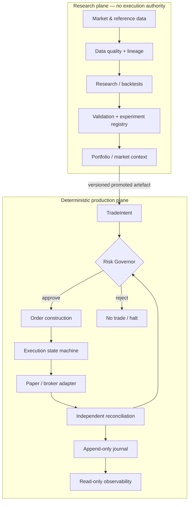

# System architecture

**Status:** research / paper architecture. The public build does not place live orders.

Optimus Prime is designed around a simple trust rule: **research may be adaptive; transactional authority must be deterministic.** The architecture therefore separates hypothesis generation and portfolio reasoning from the components that admit risk, construct orders, reconcile external state and halt the system.

## 1. System model

The public architecture can be understood as four layers.

### Research

Responsible for data ingestion, cost modelling, strategy specifications, simulation, backtesting, experiment tracking and validation. Research output is evidence, not authority.

### Portfolio

Combines validated strategy candidates with portfolio state and market context. Allocation logic can reduce or withhold capital, but cannot bypass risk policy.

### Risk

The Risk Governor is an independent deterministic admission layer. It validates each trade intent against current state, exposure, configuration and safety invariants. Its decision is authoritative: strategy code cannot override a rejection.

### Execution

Transforms approved intents into broker-compatible order state transitions, enforces idempotency, tracks lifecycle state and independently reconciles internal state with the external execution venue or paper adapter.

## 2. Trust boundaries

### Research cannot directly execute

Research tools, notebooks and language-model agents may generate code, hypotheses, reports or proposed strategy artefacts. They do not hold transactional authority and do not have a direct path to the execution gateway.

A candidate becomes executable only after it is represented as a versioned artefact and passes the relevant validation/promotion process.

### Risk is independent of strategy

The strategy layer emits a typed `TradeIntent`. It does not decide whether portfolio risk is acceptable. The Governor may approve, reject or halt based on state that strategy code cannot modify.

### External execution state is reconciled independently

The component that submits an order is not trusted to be the sole source of truth about its outcome. A separate reconciler compares internal state with the paper/broker interface and raises an explicit safety condition when they disagree.

### Observability is read-only

The command centre consumes journaled state and exposes system status, research evidence and risk decisions. It is not an alternate control plane for discretionary trading.

## 3. Event-sourced state

Important system transitions are written to an append-only journal. The journal provides three properties:

1. **Replayability** — state can be rebuilt from recorded events.
2. **Auditability** — decisions can be traced to the inputs and policy state that produced them.
3. **Mode consistency** — backtest, paper and future execution modes can share the same domain events and state machines where practical.

The journal is not treated as proof that an external order succeeded. Reconciliation remains authoritative for external state.

## 4. Fail-closed behaviour

Unknown or inconsistent state should reduce authority rather than expand it. Representative failure conditions include:

- stale or invalid market/reference data;
- broken configuration or incompatible version hashes;
- reconciliation mismatch;
- invalid order lifecycle transition;
- exposure outside policy;
- unavailable execution dependency;
- failed state reconstruction.

The default response is to block new exposure and surface the condition explicitly. Safety conditions are latched where silently resuming would be unsafe.

## 5. Modes

| Mode | Market input | Execution | Purpose |
|---|---|---|---|
| **Backtest** | historical replay | simulated fills | research and falsification |
| **Paper** | recorded or live-compatible feed | simulated execution | integration and forward evidence |
| **Shadow** | live-compatible feed | intents/orders built but not transmitted | execution-path observation |
| **Live** | external venue | external orders | intentionally disabled in the public build |

The design goal is to minimise strategy-specific differences between modes. Mode changes should occur through injected data/execution adapters and explicit configuration rather than separate business logic.

## 6. Core invariants

The implementation and tests are organised around invariants rather than optimistic happy paths. Examples include:

- research code cannot directly submit an order;
- every executable intent is evaluated by the deterministic risk layer;
- order identifiers are idempotent across retries;
- inconsistent external/internal state blocks new exposure;
- invalid or missing required data does not silently fall back to a plausible value;
- public/synthetic strategy artefacts pass through the same schemas and safety interfaces as private candidates;
- observability cannot mutate portfolio or execution state.

Detailed risk behaviour lives in [the risk-engine documentation](../risk/risk-engine.md).

## 7. Data and reproducibility

Historical market data is deliberately not committed to Git. The repository stores the code and versioned reference/configuration artefacts required to reproduce ingestion, validation and research logic.

The data layer tracks provenance and quality state so a research result can distinguish between:

- raw source data;
- normalised data;
- quarantined/invalid observations;
- synthetic fixtures;
- modelled assumptions.

This distinction matters because a backtest can be numerically reproducible and still be epistemically weak if its source data or execution assumptions are not known.

## 8. Public engine, private candidates

The reusable engine is public; current candidate strategy rules and parameters are not. A private alpha library may supply additional strategy/specification artefacts, but it receives no special execution privilege. Private candidates must satisfy the same schemas, validation requirements and deterministic risk boundaries as public synthetic examples.

See [Public engine, private alpha](../engineering/private-alpha.md).

## 9. What this architecture does not claim

This architecture is not evidence of profitable trading. It is infrastructure for making research falsifiable and deployment authority explicit.

The public repository deliberately does not contain broker-account configuration, deployment secrets, personal capital decisions, live strategy parameters or operational runbooks. Those concerns are separate from the enduring engineering model documented here.
